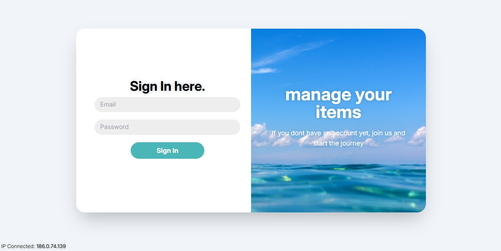

# Gestor de Tareas con React, TypeScript y Redux


Este proyecto es un **Gestor de Tareas** desarrollado con **React** y **TypeScript**. Incluye dos versiones: una tradicional y otra utilizando **Redux** para la gestión del estado. También cuenta con un componente que realiza peticiones a una API externa. El proyecto está **dockerizado** para facilitar su despliegue.

---

## 🚀 Características

✅ **Gestor de Tareas Tradicional**: Implementación sin gestión de estado global.
✅ **Gestor de Tareas con Redux**: Utiliza Redux para administrar el estado de las tareas.
✅ **Consumo de API**: Módulo que obtiene y muestra datos de una API externa.
✅ **Diseño Modular**: Código estructurado en componentes reutilizables.
✅ **Dockerizado**: Preparado para ejecutarse en un contenedor Docker.

---

## 📂 Estructura del Proyecto

```
📦 Gestor de Tareas
├── 📂 dist
├── 📂 node_modules
├── 📂 public
├── 📂 src
│   ├── 📂 assets
│   ├── 📂 components
│   │   ├── 📂 layout
│   │   │   ├── 📂 confirmationModal
│   │   │   ├── 📂 footer
│   │   │   ├── 📂 form
│   │   │   ├── 📂 Header
│   │   │   ├── 📂 item
│   │   │   ├── 📂 taskList
│   │   ├── 📂 pages
│   │   │   ├── 📂 ApiDataTable
│   │   │   ├── 📂 auth
│   │   │   ├── 📂 home
│   │   │   ├── 📂 redux
│   ├── 📂 firebase
│   ├── 📂 provider
│   ├── 📂 services
│   ├── 📂 utils
```

---
## Despliegue
Puedes ver el proyecto desplegado en este link: [JikkoSoft_ Technical_Test](https://jikkosoft.netlify.app/)


## 🛠 Instalación y Ejecución

### 🔹 Prerrequisitos
- [Node.js](https://nodejs.org/) (v20 o superior)
- [Yarn](https://yarnpkg.com/) (opcional, puedes usar npm)
- [Docker](https://www.docker.com/) (opcional, para ejecutar con Docker)

### 🔹 Clonar el Repositorio
```bash
git clone https://github.com/Mari293/JikkosoftTechnicalTest.git
cd JikkosoftTechnicalTest
```

### 🔹 Ejecutar el Proyecto

#### Opción 1: Usando Yarn (o npm)
```bash
yarn install  # Instalar dependencias
yarn start    # Iniciar el servidor
```

#### Opción 2: Usando Docker
```bash
docker-compose up --build
```
_Asegúrate de tener Docker instalado antes de ejecutar este comando._

---

### 🔹 Recomendaciones
En caso de que el login no funcione correctamente por problemas con Firebase, descarga el proyecto de manera local, realizas el login y si no entra en la url pones "/home" deberia quedar asi: http://localhost:5173/home


## 🖼 Capturas de Pantalla
### Login
Para poder ingresar estas son las credenciales (Email: test@gmail.com y Password: 123456)


### Gestor de Tareas 


### Gestor de Tareas con alerta


### Consumo de API


### Gestor de Tareas con Redux

---

## 📜 Licencia
Este proyecto está bajo la licencia **MIT**, una licencia de software libre y de código abierto que permite su uso, modificación y distribución sin restricciones. Puedes ver más detalles en el archivo `LICENSE`.

---

## ✨ Autora
**Mariana Cruz González**

Si tienes preguntas o sugerencias, no dudes en contribuir o contactarme.

---
